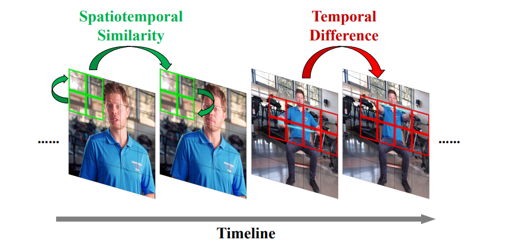
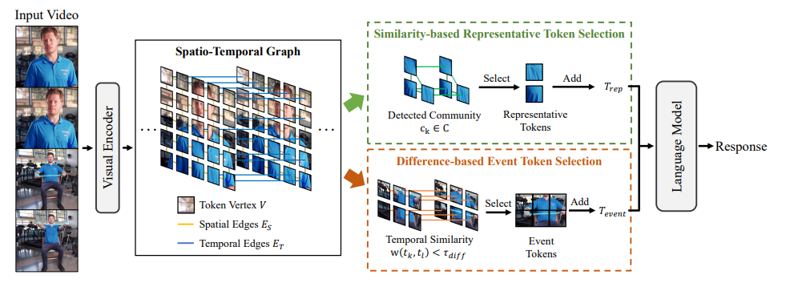
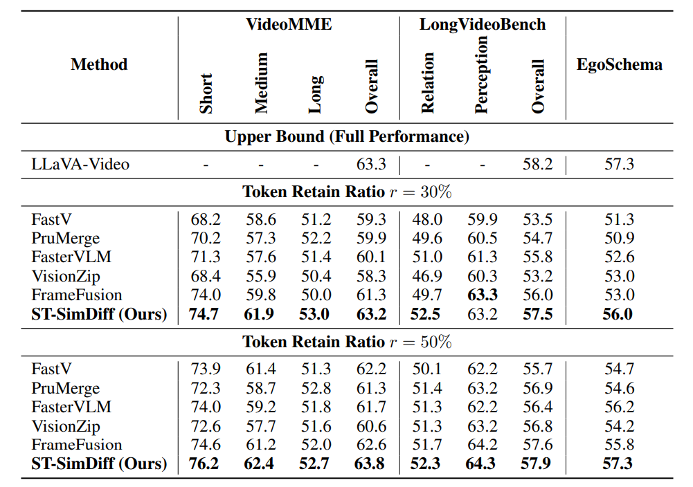

# ST-SimDiff: Balancing Spatiotemporal Similarity and Difference for Efficient Video Understanding with MLLMs

We proposed ST-SimDiff, a training-free framework that begins by constructing a spatiotemporal graph from visual tokens to uniformly model their complex relationships. The framework then employs a parallel dual-selection strategy: similarity-based selection applies community detection to retain representative tokens and compress static information, while temporal difference-based selection precisely locates content-changing points to preserve tokens that capture essential dynamic transitions. This approach enables the preservation of both static and dynamic content using a minimal set of tokens.





We conduct experiments on various datasets, demonstrating effectiveness of our method.



## Environment Setup

Please refer to https://github.com/EvolvingLMMs-Lab/lmms-eval

```bash
conda create --name exp1 python=3.10
pip install -e .
pip install matplotlib
pip install transformers==4.51.3
```

## Evaluation

We provide example scripts for reproducing results of our method. Raw logs of experimental results are put in 'logs/' directory.

For most datasets, you can get the final scores by replacing `$TASK` with dataset name. For checkpoints, you can specify which model to use by replacing `--model_args pretrained`. 

To run experiments, you should use the following command:

```bash
for cost in 0.3 ; do
for event_upper_bound in 0.2; do
    for similarity_lower_bound in 0.8; do
        for TASK in videomme; do
            python -m accelerate.commands.launch \
                --num_processes=2 \
                -m lmms_eval \
                --model llava_video \
                --model_args pretrained=../model/llava-video,conv_template=qwen_1_5,model_name=llava_qwen,max_frames_num=64,cost=$cost,similarity_lower_bound=$similarity_lower_bound,event_upper_bound=$event_upper_bound,merge_type=new_topk,right=True,bottom=True,spatial=True,temporal=True,strategy=3,mm_spatial_pool_mode=bilinear\
                --tasks $TASK \
                --batch_size 1 \
                --output_path ./logs/ \
                # --limit 600
        done 
    done
done
done 
```

